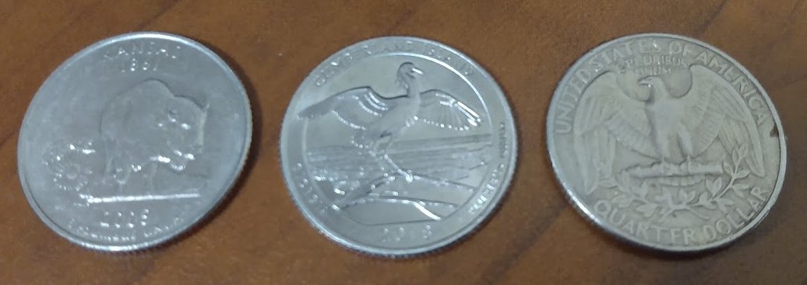

```{r setup, include=FALSE}
knitr::opts_chunk$set(echo = FALSE)
```

## Abstract

Three different quarters were spun 50 times each. Their chances of landing heads were characterized with 95% confidence intervals. Some of the quarters exhibited clear bias.

## Introduction

- Coins are used in sports and (sometimes) elections
```{r, out.width = "400px"}
knitr::include_graphics("https://upload.wikimedia.org/wikipedia/commons/thumb/5/54/Coin_toss_at_Super_Bowl_43_1.jpg/800px-Coin_toss_at_Super_Bowl_43_1.jpg")
```

## Introduction

>- A biased coin is a classic context for probability
>- Making a coin flip with bias is very difficult
>- Many coins have bias when spun on edge on a flat surface
>- Do different quarters have different biases?


## Method

- Three quarters:
 
|     | Buffalo | Crane | Eagle |
|:---:|:---:|:---:|:---:|
|year | 2005  | 2018 | 1977 |
|state| Kansas| Georgia| Standard |

```{r, out.width = "800px",fig.align="center"}

```


## Method

Each quarter was spun 50 times on a smooth surface.

A 95% confidence interval was constructed for each coin.
$$CI ~=~ \left(\hat{p}-z^\star\sqrt{\frac{\hat{p}(1-\hat{p})}{n}},~\hat{p}+z^\star\sqrt{\frac{\hat{p}(1-\hat{p})}{n}} \right) $$
(For a confidence level of 95%, $z^\star = 1.96$.)


## Results

```{r results}
q1 = c(1,1,1,1,0,1,1,0,0,1,1,0,0,1,1,1,1,1,1,1,1,0,1,1,1,1,1,1,1,0,1,0,1,0,0,1,1,1,0,1,0,1,1,0,0,1,1,1,1,1)
q2 = c(1,1,1,0,1,0,1,1,1,1,1,0,1,1,1,1,1,0,1,1,1,1,1,1,1,1,1,1,1,1,1,1,0,0,1,1,1,1,0,1,1,0,1,1,1,1,1,1,1,0)
q3 = c(0,0,0,0,1,1,0,0,1,0,0,1,0,0,1,1,0,0,1,1,0,0,1,1,1,0,1,0,1,1,0,0,1,0,0,1,1,1,0,1,0,0,1,0,0,1,1,1,0,1)
n = c(length(q1),length(q2),length(q3))
ns = c(sum(q1),sum(q2),sum(q3))
phat = ns/n
z = round(qnorm(0.975),2)
se = sqrt(phat*(1-phat)/n)
me = z*se
lb = round(phat-me,3)
ub = round(phat+me,3)
```

Statistic | Buffalo | Crane | Eagle |
|:---:|:---:|:---:|:---:|
| number of flips ($n$) | `r n[1]` | `r n[2]` | `r n[3]` |
| number of heads | `r ns[1]`|`r ns[2]`|`r ns[3]`|
| $\hat{p}$| `r phat[1]`|`r phat[2]`|`r phat[3]`|
| 95% confidence interval| (`r lb[1]`, `r ub[1]`) | (`r lb[2]`, `r ub[2]`) | (`r lb[3]`, `r ub[3]`) |

## Results


```{r compare,fig.cap = "The sample proportions with 95% confidence intervals of the population proportions. The dotted line represents sits at $p=0.5$."}
bp = barplot(phat,names.arg=c("Buffalo\n(Kansas 2005)","Crane\n(Georgia 2018)","Eagle\n(1977)"), main="Proportion of Heads", col="red", ylim=c(0,1))
for(i in 1:3){
  lines(c(bp[i],bp[i]),c(lb[i],ub[i]))
  lines(c(bp[i]-0.2,bp[i]+0.2),c(lb[i],lb[i]))
  lines(c(bp[i]-0.2,bp[i]+0.2),c(ub[i],ub[i]))
  lines(c(bp[i]-0.5,bp[i]-0.5),c(0,1))
  lines(c(bp[i]+0.5,bp[i]+0.5),c(0,1))
  lines(c(bp[i]-0.5,bp[i]+0.5),c(1,1))
}
lines(c(bp[1]-0.7,bp[3]+0.7),c(0.5,0.5),lty=2)
```

## Discussion

>- The Buffalo and Crane quarters have clear bias.
>- How else can randomization devices display bias?
>- What are the physical mechanisms of the bias?

# Thanks!