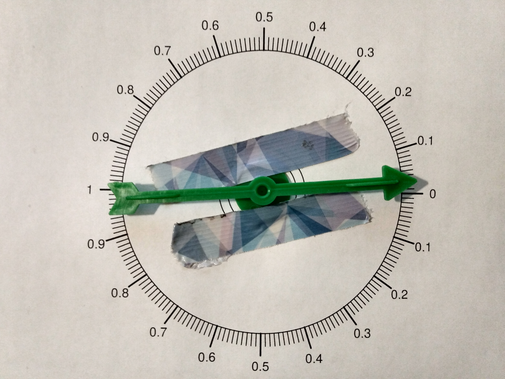

```{r setup, include=FALSE}
knitr::opts_chunk$set(echo = FALSE)
```

## Abstract

>- I was able to aim a spinner significantly better than random chance when aiming for a half rotation ($p$-value = 0.003), but not when aiming for a full rotation ($p$-value = 0.13).
>- I would have guessed I was able to consistently spin it almost exactly 2 rotations every time, but that was very optimistic.
>- Aiming a spinner is difficult.


# Introduction

## Spinners are used to randomize

Wheel of Fortune:

```{r, out.width = "400px"}
knitr::include_graphics("https://upload.wikimedia.org/wikipedia/commons/b/be/Wheel_of_Fortune_Round_1_template_Season_31.png")
```

MarioGS, CC 3.0

## Spinners are useful metaphors


```{r makespinner,echo=F,fig.width=5,fig.height=5,fig.align='center'}
par(mar=c(0,0,0,0))
plot(1,1,type='n',axes=F,ann=F,xlim=c(-1,1),ylim=c(-1,1))
for(i in 1:100/100*2*pi){
  lines(c(cos(i)*0.75,cos(i)*0.8),c(sin(i)*0.75,sin(i)*0.8))
}
for(i in 1:10/10*2*pi){
  lines(c(cos(i)*0.65,cos(i)*0.8),c(sin(i)*0.65,sin(i)*0.8))
}
lines(c(0.5,0.8),c(0,0),lwd=3)
for(i in 1:9){
  text(cos(i/10*2*pi)*0.59,sin(i/10*2*pi)*0.59,i/10)
}
for(i in 0:100){
  if(i%%10 != 0){
    text(cos(i/100*2*pi)*0.69,sin(i/100*2*pi)*0.69,i/100,cex=0.6,srt=((i/100*360)+90)%%180-90)
  }
}
text(0.57,0.04,"0")
text(0.57,-0.04,"1")
for(zz in -30:30/10){
  lines(c(cos(pnorm(zz)*2*pi)*0.8,cos(pnorm(zz)*2*pi)*0.85),c(sin(pnorm(zz)*2*pi)*0.8,sin(pnorm(zz)*2*pi)*0.85))
}
for(zz in -20:20/10){
  if(zz%%1 != 0){
    text(cos(pnorm(zz)*2*pi)*0.89,sin(pnorm(zz)*2*pi)*0.89,zz,cex = 0.6)
  }
}
for(zz in -3:3){
  lines(c(cos(pnorm(zz)*2*pi)*0.8,cos(pnorm(zz)*2*pi)*0.95),c(sin(pnorm(zz)*2*pi)*0.8,sin(pnorm(zz)*2*pi)*0.95),lwd=2)
}
for(zz in -2:2){
    text(cos(pnorm(zz)*2*pi)*0.99,sin(pnorm(zz)*2*pi)*0.99,zz)
}
text(0.99,0.03,"-3")
text(0.99,-0.03,"3")
lines(cos(0:100/100*2*pi)*0.8,sin(0:100/100*2*pi)*0.8)

text(0.45,0,"U")
text(1.05,0,"Z")
```

\vspace{-50pt}

$$P(0<Z<1)~\approx~0.84-0.5 $$


## But how random are spinners?

>- Spinners are not inherently chaotic
>- I guessed I would be able to repeatedly spin a spinner $2.5\pm0.5$ rotations without much trouble.


# Method

## Spinner

```{r, out.width = "600px"}

```

## Spinner

```{r usedspinner,fig.width=5,fig.height=5,fig.align='center'}
{
par(mar=c(0,0,0,0))
plot(0,0,type='n',axes=F,ann=F,xlim=c(-1,1),ylim=c(-1,1))
thetas = seq(0,2*pi,length.out=2001)
polygon(0.8*cos(thetas),0.8*sin(thetas))
for(p in seq(0,0.25,0.05)){
  polygon(p*cos(thetas),p*sin(thetas))
}

for(theta in seq(0,2*pi,length.out=201)){
  lines(c(0.87*cos(theta),0.8*cos(theta)),c(0.87*sin(theta),0.8*sin(theta)))
  }

for(th in seq(0,2*pi,length.out=21)){
  lines(c(0.92*cos(th),0.8*cos(th)),c(0.92*sin(th),0.8*sin(th)),lwd=2)
  u = 1-abs(pi-th)/pi
  text(0.98*cos(th),0.98*sin(th),u)
}

for(i in 0:100){
  if(i%%10 != 0){
    text(cos(i/100*pi)*0.91,sin(i/100*pi)*0.91,i/100,cex=0.4,srt=((i/100*180)+90)%%180-90)
    text(cos(i/100*pi)*0.91,-sin(i/100*pi)*0.91,i/100,cex=0.4,srt=-((i/100*180)+90)%%180-90)
  }
}
text(0.53,0,"start \n & \n target of full-spin",cex=0.8)
text(-0.53,0,"target of half-spin",cex=0.8)
}
```


## Two types of trials

```{r nada}
se = sqrt(1/12/100)
z = 1.96
lb = signif(0.5-z*se,3)
ub = signif(0.5+z*se,3)
```

>- 100 trials attempted to spin 1/2 a rotation to land on the 1
>- 100 trials attempted to spin 1 full rotation to land on the 0
>- If accurate, I would get a sample mean significantly above (or below) 0.5
>- If spins are random, the sample mean should be approximately 0.5 ($\pm$ SE)
>- The standard uniform distribution has $\mu = 0.5$ and $\sigma = \sqrt{\frac{1}{12}}$ 
>- see [uniform distribution](https://en.wikipedia.org/wiki/Uniform_distribution_(continuous))


## Hypothesis testing 

$$H_0 ~~~\text{ claims }~~~ \mu=0.5 \text{ and } \sigma =\sqrt{\frac{1}{12}}$$
When 100 random spins are spun, the sampling distribution of the sample mean should be normally distributed.
$$\text{With }n=100,~H_0 ~~\text{claims}~~ \bar{x}\sim \mathcal{N}\left(0.5,\,\frac{\sqrt{\frac{1}{12}}}{\sqrt{100}}\right) $$
If $H_0$ is true, we expect the sample mean to be between `r lb` and `r ub`. (Determined with $z=1.96$ and $\mu \pm \frac{z\sigma}{\sqrt{n}}$)
$$P(`r lb` < \bar{x} < `r ub`) ~=~ 0.95 $$


# Results

## Histograms

```{r data}
spins = c(0.67, 0.885, 0.15, 0.76, 0.99, 0.71, 0.06, 0.24, 0.76, 0.68, 0.1, 0.67, 0.19, 0.23, 0.62, 0.71, 0.47, 0.62, 0.48, 0.075, 0.4, 0.485, 0.06, 0.485, 0.65, 0.97, 0.885, 0.51, 0.76, 0.87, 0.61, 0.47, 0.97, 0.92, 0.14, 0.99, 0.31, 0.545, 0.855, 0.72, 0.89, 0.705, 0.99, 0.02, 0.74, 0.63, 0.58, 0.2, 0.86, 0.99, 0.94, 0.85, 0.9, 0.35, 0.59, 0.53, 0.95, 0.81, 0.665, 0.46, 0.69, 0.99, 0.48, 0.95, 0.14, 0.61, 0.485, 0.62, 0.02, 0.15, 0.46, 0.35, 0.81, 0.92, 0.47, 0.885, 0.06, 0.69, 0.72, 0.76, 0.97, 0.65, 0.855, 0.63, 0.075, 0.705, 0.47, 0.67, 0.86, 0.2, 0.19, 0.03, 0.9, 0.99, 0.67, 0.68, 0.1, 0.24, 0.23, 0.76)
spins2 = c(0.18, 0.36, 0.58, 0.09, 0.675, 0.8, 0.1, 0.05, 0.92, 0.135, 0.65, 0.41, 0.75, 0.785, 0.845, 0.19, 0.905, 0.39, 0.775, 0.59, 0.775, 0.001, 0.485, 0.535, 0.85, 0.865, 0.61, 0.06, 0.845, 0.615, 0.245, 0.15, 0.41, 0.002, 0.13, 0.91, 0.47, 0.035, 0.615, 0.735, 0.73, 0.355, 0.97, 0.47, 0.065, 0.19, 0.12, 0.845, 0.475, 0.013, 0.305, 0.18, 0.265, 0.165, 0.32, 0.575, 0.04, 0.99, 0.58, 0.14, 0.895, 0.62, 0.82, 0.82, 0.89, 0.67, 0.79, 0.47, 0.86, 0.001, 0.38, 0.34, 0.5, 0.37, 0.15, 0.46, 0.7, 0.265, 0.165, 0.31, 0.39, 0.11, 0.05, 0.64, 0.36, 0.19, 0.55, 0.84, 0.02, 0.19, 0.29, 0.7, 0.51, 0.03, 0.13, 0.75, 0.71, 0.21, 0.43, 0.69)

par(mfrow=c(1,2))
hist(spins,breaks=10,main="Target=1, with a half spin",xlab="final position")
hist(spins2,breaks=10,main="Target=0, with a full spin",xlab="final position")

mu0 = 0.5
sig0 = sqrt(1/12)

n = length(spins)
xbar = mean(spins)
z = (xbar-mu0)/sig0*sqrt(n)
pvalue = pnorm(-abs(z))*2
s = sd(spins)

n2 = length(spins2)
xbar2 = mean(spins2)
z2 = (xbar2-mu0)/sig0*sqrt(n2)
pvalue2 = pnorm(-abs(z2))*2
s2 = sd(spins2)

tstar = round(qt(0.975,99) ,2)
```

## Hypothesis test results

| Statistic  | Half spin | Full spin |
|:----------:|:---------:|:----------:|
|   $n$      | `r length(spins)` | `r length(spins2)`|
|  $\bar{x}$ | `r signif(mean(spins),3)`   | `r signif(mean(spins2),3)`  |
| $z$        | `r round(z,2)`             | `r round(z2,2)`     |
| $p$-value (two-tail) | `r signif(pvalue,2)` | `r signif(pvalue2,2)`|

>- In 100 spins, I was significantly better than random at aiming a half-spin at the 1.
>- In 100 spins, I was not significantly better than random at aiming a full-spin at the 0.


## 95% Confidence intervals

$df = 99$ and $t^\star = `r round(qt(0.975,99) ,2)`$

| Statistic   | Half spin | Full spin |
|:----------:|:---------:|:----------:|
|$n$ | `r length(spins)` | `r length(spins2)`|
|$\bar{x}$    | `r signif(mean(spins),3)`   | `r signif(mean(spins2),3)`  |
|$s$    | `r round(s,3)`             | `r round(s,3)`     |
|$t^\star\frac{s}{\sqrt{n}}$    | `r signif(tstar*s/sqrt(n),2)` | `r signif(tstar*s2/sqrt(n2),2)`|
|$LB= \bar{x}-t^\star\frac{s}{\sqrt{n}}$    | `r signif(xbar-tstar*s/sqrt(n),2)` | `r signif(xbar2-tstar*s2/sqrt(n2),2)`|
|$UB= \bar{x}+t^\star\frac{s}{\sqrt{n}}$    | `r signif(xbar+tstar*s/sqrt(n),2)` | `r signif(xbar2+tstar*s2/sqrt(n2),2)`

## 95% Confidence intervals

When attempting to make a half-spin, I am 95% confident that the expected value is between `r signif(xbar-tstar*s/sqrt(n),2)` and `r signif(xbar+tstar*s/sqrt(n),2)`
$$CI_{\text{half-spin}} ~=~ (`r signif(xbar-tstar*s/sqrt(n),2)`,~`r signif(xbar+tstar*s/sqrt(n),2)`) $$
When attempting to make a full-spin, I am 95% confident that the expected value is between `r signif(xbar2-tstar*s2/sqrt(n2),2)` and `r signif(xbar2+tstar*s2/sqrt(n2),2)`
$$CI_{\text{full-spin}} ~=~ (`r signif(xbar2-tstar*s2/sqrt(n2),2)`,~`r signif(xbar2+tstar*s2/sqrt(n2),2)`) $$

# Discussion

## Discussion

>- I was able to significantly beat random spins when targeting a half-spin
>- Aiming the spinner proved more difficult than I guessed before
>- I wonder how successful other people would be
>- I wonder how difficult it is to alter the probabilities of other randomization devices